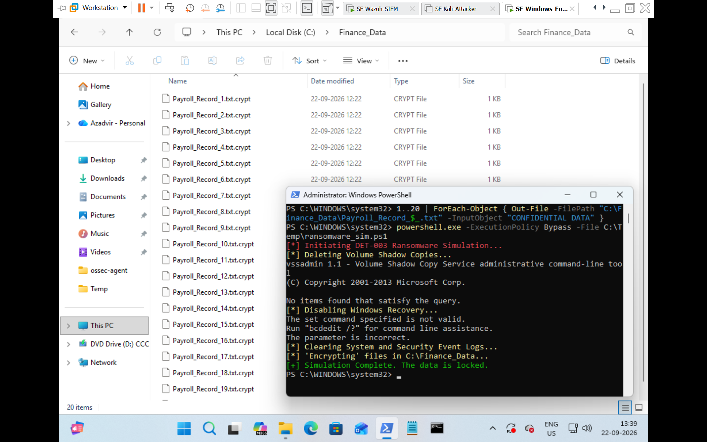
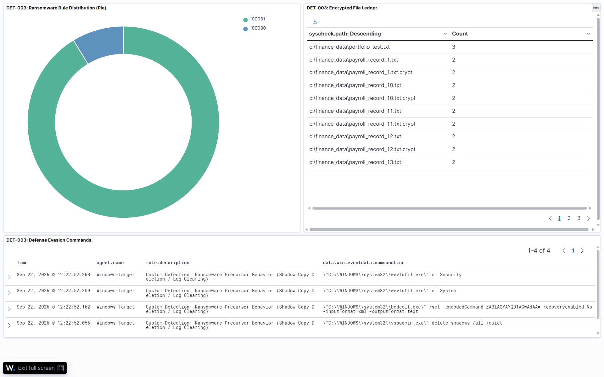
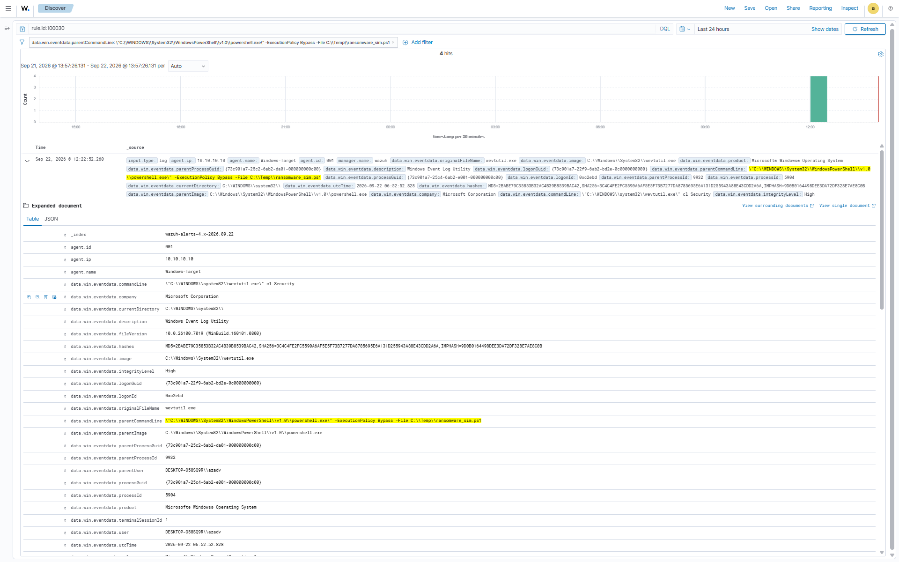
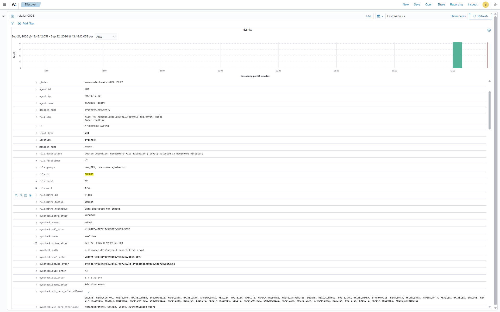

# INC-003 — Ransomware Behavior Simulation

## 1. Incident Summary

A multi-stage adversary simulation was executed against the Windows 11 endpoint (Windows-Target) within the SentinelForge laboratory.
The attacker utilized native administrative utilities and automated scripting to evade detection, impair system recovery mechanisms, and execute mass file encryption across a targeted corporate directory.
The attack chain progressed through two distinct phases: defense evasion via `vssadmin.exe`, `bcdedit.exe`, and `wevtutil.exe` to destroy shadow copies, disable the Windows Recovery Environment, and clear event logs, followed by rapid data impact via the renaming and encryption of files in `C:\Finance_Data` to a `.crypt` extension.
Two custom Wazuh detection rules (100030 and 100031) successfully correlated the underlying Sysmon Event ID 1 (Process Creation) and Wazuh File Integrity Monitoring (`syscheck`) telemetry across the entire kill chain.

## 2. Incident Details

| Field | Value |
| :--- | :--- |
| **Incident ID** | INC-003 |
| **Detection ID** | DET-003 |
| **Rule IDs** | 100030, 100031 |
| **Alert Levels** | 12 (Critical), 12 (Critical) |
| **Source / C2 IP** | Local Execution (Scripted) |
| **Target Hostname** | DESKTOP-O58SQ9R (Windows-Target) |
| **Target IP** | 10.10.10.10 |
| **Target Account** | DESKTOP-O58SQ9R\azadv |
| **Target Data** | Corporate documents in `C:\Finance_Data` |
| **Exfiltration Protocol** | N/A (Encryption in place) |
| **Compromised Credentials Exposed** | No |
| **Status** | Closed |

## 3. Attack Source & Target

**Source (Attacker)**
* **OS:** Windows 11 (Local Execution)
* **Vector:** Administrative PowerShell session executing `ransomware_sim.ps1`

**Target**
* **OS:** Windows 11
* **Hostname:** DESKTOP-O58SQ9R
* **Agent ID:** 001
* **IP:** 10.10.10.10
* **User Context:** DESKTOP-O58SQ9R\azadv (High Integrity)

The attack was performed entirely within the isolated SentinelForge laboratory.

## 4. Detection

The malicious activity was detected across multiple stages by custom Wazuh rules ingesting `Microsoft-Windows-Sysmon/Operational` and `syscheck` logs:

* **Rule ID 100030 (Level 12):** Custom Detection: Defense Impairment and Recovery Invalidation (T1490/T1070)
* **Rule ID 100031 (Level 12):** Custom Detection: Ransomware File Extension (.crypt) Detected in Monitored Directory (T1486)

**Detection Logic:**
* **Phase 1 (Defense Evasion):** Sysmon Event ID 1 where `win.eventdata.commandLine` matches regex `(?i)(vssadmin.*delete\s+shadows|bcdedit.*recoveryenabled\s+no|wevtutil.*cl\s+(application|security|system))`. Triggers Rule 100030.
* **Phase 2 (Data Impact):** Wazuh `syscheck` file modification event where the raw log contains `<match>.crypt</match>`. Triggers Rule 100031.

## 5. Timeline

* **Initial Access:** Script execution initiated via an administrative PowerShell process (`powershell.exe -ExecutionPolicy Bypass -File C:\Temp\ransomware_sim.ps1`).
* **Phase 1 (Defense Impairment):** Exactly 4 high-severity events were ingested via the `Microsoft-Windows-Sysmon/Operational` event channel. Telemetry logged process spawning of `vssadmin.exe` with arguments removing Volume Shadow Copies, `bcdedit.exe` disabling boot recovery options, and `wevtutil.exe` attempting log destruction (Rule 100030).
* **Phase 2 (File Encryption):** Wazuh File Integrity Monitoring (`syscheck`) identified real-time changes within `C:\Finance_Data`. Multiple file modification events generated corresponding alerts as `.txt` files were modified and appended with the `.crypt` extension (Rule 100031).

## 6. Investigation & Findings

The investigation established:
* **Recovery Subversion:** The adversary explicitly targeted host-level recovery options to maximize impact. By deleting shadow copies and disabling WinRE, the actor ensured that local, offline restoration tools were inaccessible.
* **Indicator Removal:** The clearing of the Application and System event logs was an immediate attempt to blind local security monitoring and delay incident response efforts.
* **Mass Encryption Simulation:** The targeted directory (`C:\Finance_Data`) was methodically encrypted, mimicking the rapid file I/O operations characteristic of ransomware payloads.
* **Alert Fidelity:** Custom rules 100030 and 100031 generated high-severity alerts without false-positive overlap, accurately isolating the adversarial behavior from baseline system administration tasks.
* **Conclusion:** The activity was confirmed to be an intentional multi-stage ransomware simulation performed within the SentinelForge laboratory.

## 7. MITRE ATT&CK Mapping

| Tactic | Technique ID | Technique Name | Target / Command Executed |
| :--- | :--- | :--- | :--- |
| **Defense Evasion (TA0005)** | T1490 | Inhibit System Recovery | `vssadmin delete shadows /all /quiet`, `bcdedit /set {default} recoveryenabled No` |
| **Defense Evasion (TA0005)** | T1070 | Indicator Removal | `wevtutil cl Application`, `wevtutil cl System` |
| **Impact (TA0040)** | T1486 | Data Encrypted for Impact | Bulk modification of `.txt` files to `.crypt` in `C:\Finance_Data` |

## 8. Impact Assessment

* **Execution Success:** Yes (Administrative script execution achieved)
* **Privilege Elevation / Access:** High-integrity execution utilized
* **Data Impact:** Confirmed (Target files successfully encrypted with `.crypt` extension)
* **Production Impact:** None (Contained within isolated lab environment)

The incident represents a high-impact ransomware behavioral chain that succeeded at the host level but was comprehensively recorded and alerted across all vectors.

## 9. Response & Recovery

Because this was a controlled laboratory simulation, no emergency production containment was required.
The following remediation and cleanup steps were executed:
* Deleted malicious artifacts: `C:\Temp\ransomware_sim.ps1`
* Purged the `.crypt` files from `C:\Finance_Data` and restored original `.txt` dummy files.
* Restarted the `WazuhSvc` on the Windows host to re-establish the `syscheck` baseline for the monitored directory.

In an enterprise environment, containment would mandate immediate endpoint host isolation, blocking network egress to prevent potential C2 key negotiation, and initiating enterprise-wide threat hunts for similar `vssadmin` or `.crypt` file creation events.

## 10. Lessons Learned & Detection Improvement

The simulation confirmed that relying on signature-based antivirus is insufficient for detecting behavioral ransomware attacks leveraging native administrative tools. Detecting attacks via Sysmon telemetry and FIM provided full-chain visibility.

Identified detection engineering enhancements:
* **Active Response Deployment:** Deploy an automated Active Response block via Wazuh to immediately terminate parent PowerShell/CMD processes when Rule 100030 is detected, stopping encryption prior to phase two.
* **Access Control Hardening:** Restrict execution privileges for `vssadmin.exe`, `bcdedit.exe`, and `wevtutil.exe` to high-privilege administrative service accounts, removing general user access.
* **Immutable Backups:** Transition critical enterprise shares to write-once-read-many (WORM) storage to invalidate the impact of shadow copy and local backup purges.
* **Rule Engine Match Logic:** Standardized field parsing using substring pattern matching (`<match>`) in Wazuh XML rules to avoid schema inconsistencies between UI display fields (`syscheck.path`) and internal decoder representations (`file`).

---

## Evidence & References

**Evidence Directory:** `Dashboards/screenshots/`
* `DET-003-attack-execution.png`
* `DET-003-wazuh-alert-100030.png`
* `DET-003-wazuh-alert-100031.png`
* `DET-003-Ransomware-Dashboard.png`

**Related Documentation:**
* **Attack Documentation:** `Attacks/windows/DET-003-Ransomware-Behavior-Simulation/attack.md`
* **Attack Commands:** `Attacks/windows/DET-003-Ransomware-Behavior-Simulation/commands.md`
* **Detection Matrix:** `Detections/detection-matrix.csv`

---

## Final Assessment

* **Incident:** Ransomware Behavior Simulation
* **Detection:** Successful (2 Rules Triggered)
* **Rules:** 100030, 100031
* **MITRE:** T1490, T1070, T1486
* **Source:** Local Administrative Execution
* **Target:** 10.10.10.10 (Windows-Target)
* **Data Impact:** Confirmed Bulk File Encryption (`.crypt`)
* **Status:** CLOSED

---

## Dashboard Visualizations

*Figure 1.0: Target Endpoint - Administrative PowerShell executing ransomware simulation script.*

*Figure 1.1: Complete OpenSearch Dashboard illustrating attack phase distribution, compromised file ledger, and defense evasion command telemetry.*

*Figure 1.2: Rule 100030 (Level 12) triggering on defense evasion commands (vssadmin).*

*Figure 1.3: Rule 100031 (Level 12) FIM alert capturing rapid .crypt file creation.*
